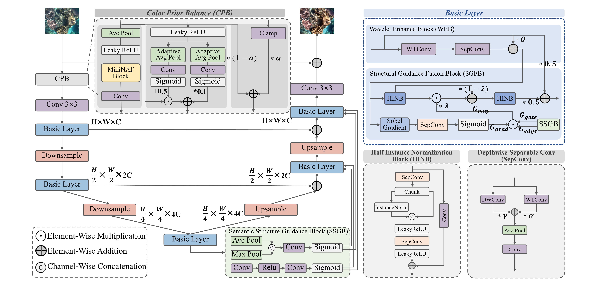
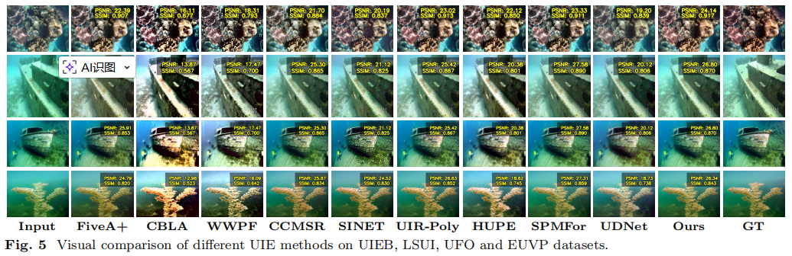
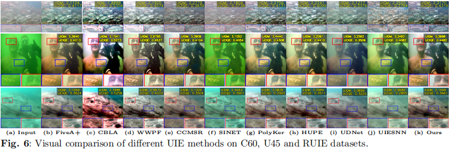
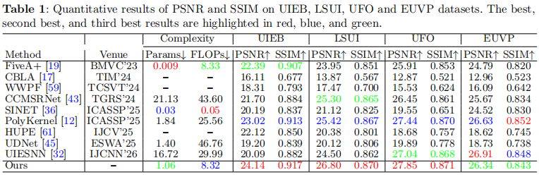
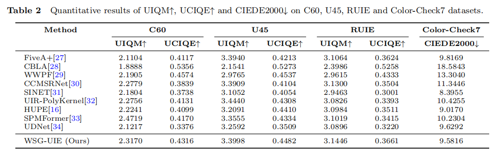

# Wavelet and Structure Guided Lightweight Network for Underwater Image Enhancement

[](https://doi.org/10.5281/zenodo.20142586)

This repository contains the source code, pretrained weights, dataset links, testing result links, and detailed training/testing instructions for our The Visual Computer submission.

## Abstract

Underwater image enhancement is critical for ocean exploration, underwater robotics, and marine vision systems. Wavelength-dependent absorption and scattering cause severe color casts, low contrast, and detail loss in underwater imaging. This work addresses degradation issues by developing a lightweight end-to-end framework unifying color prior correction, wavelet-domain modeling, and structure-guided modulation. The method uses adaptive color balance, multi-scale wavelet enhancement, and gradient-aware fusion to restore chromatic fidelity and fine details while suppressing noise. Here we show the approach achieves 24.14 dB PSNR and 0.917 SSIM on UIEB benchmark, outperforming competing methods with only 1.06M parameters. It also boosts performance in object detection and semantic segmentation, offering practical value for real-time underwater vision applications. Code is available at https://github.com/gzy7/WSG-UIE.

## Overview



## Environment

- OS: Ubuntu 22.04
- Python: 3.10
- CUDA: 11.8
- Miniconda3

## Create Environment

```bash
conda create -n WSG-UIE python=3.10 -y
conda activate WSG-UIE
pip install torch torchvision torchmetrics
pip install -r requirements.txt
```

## Dataset Preparation

Please download the datasets from the following links and place them in the `datasets/` directory.

Paired Datasets:

- UIEB: [Google Drive](https://drive.google.com/file/d/1TZge0v5OzWWC8ZTxG7-NE7nVl0a4IeLb/view?usp=drive_link)
- LSUI: [Google Drive](https://drive.google.com/file/d/159oI-U4y1tB5XjohQF5Yh87Mivq7IXv0/view?usp=drive_link)
- UFO: [Google Drive](https://drive.google.com/file/d/1Ij-fOthwBzxV9kScDSvmImeDcWQ7zJqE/view?usp=drive_link)
- EUVP: [Google Drive](https://drive.google.com/file/d/1LaUCWq__csU7-u8zdd7gfmlpWGUmSZAD/view?usp=drive_link)
```text
├── UIEB/
│   ├── train/
│   │   ├── low/
│   │   └── high/
│   └── test/
│       ├── low/
│       └── high/
├── LSUI/
│   ├── train/
│   │   ├── low/
│   │   └── high/
│   └── test/
│       ├── low/
│       └── high/
├── UFO/
│   ├── train/
│   │   ├── low/
│   │   └── high/
│   └── test/
│       ├── low/
│       └── high/
└── EUVP/
    ├── train/
    │   ├── low/
    │   └── high/
    └── test/
        ├── low/
        └── high/
```

Unpaired Datasets:

- C60: [Google Drive](https://drive.google.com/file/d/1wencN8I9-VSDbZL0U5jgJyAIbUbtrgDX/view?usp=drive_link)
- U45: [Google Drive](https://drive.google.com/file/d/1iigjP9nbQvE3JeVRsKBPgkda53mG6vtT/view?usp=drive_link)
- RUIE: [Google Drive](https://drive.google.com/file/d/1U_RbNaaSjkrIxz-r-lvzKXUnMaLwgRTM/view?usp=drive_link)
- Color-Check7: [Google Drive](https://drive.google.com/file/d/17BP9LbK6Qq24fsIgAsoZampzj0B80Rhu/view?usp=drive_link)
```text
├── C60/
├── U45/
├── RUIE/
└── Color-Check7/
```

## Results

We provide all enhanced results [Google Drive](https://drive.google.com/file/d/1EqSA8Rgn1birkYwG25gPsi9MKBSHAZRN/view?usp=drive_link) for easy comparison and visualization.

## Visual Comparisons

<p align="center">
  
</p>

<p align="center">
  
</p>

## Quantitative Results

<p align="center">
  
</p>

<p align="center">
  
</p>

## Training

```bash
python train.py
```

## Testing (paired datasets)

```bash
python test.py --ckpt "your checkpoint" --dataset 'your dataset' --test_batch_size 'your size'
```

## Testing (unpaired datasets)
When testing unpaired datasets, please select the second annotated code in the metrics.py to run.
```bash
python test_unpaired.py --ckpt "your checkpoint" --dataset 'your dataset'
```

## Citation
Cite our work if WSG-UIE is useful to your research.

```bash
@article{WSG-UIE,
  title={Wavelet and Structure Guided Lightweight Network for Underwater Image Enhancement},
  author={Guo, Zengyang and Cai, Zhidan and Yuan, Zhaozhu and Xia, Haoyao},
  journal={The Visual Computer},
  pages={xxx--xxx},
  year={2026},
  publisher={Springer}
}
```

## Acknowledgement

This work is based on the implementation of WWE-UIE (https://github.com/chingheng0808/WWE-UIE).
We gratefully acknowledge the authors for providing the codebase, which we use as the baseline for our experiments.

## Contact
If you have any questions, please contact the email 2020000011@mails.cust.edu.cn
